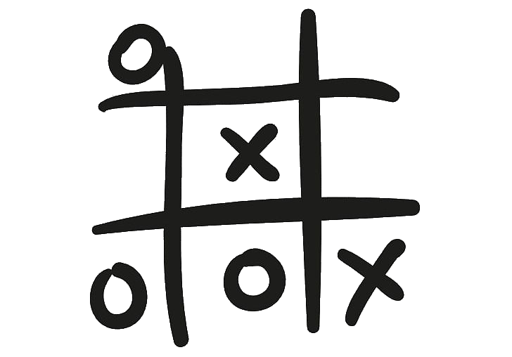

[![Contributors][contributors-shield]][contributors-url]
[![Forks][forks-shield]][forks-url]
[![Stargazers][stars-shield]][stars-url]
[![Issues][issues-shield]][issues-url]
[![LinkedIn][linkedin-shield]][linkedin-url]


<!-- PROJECT LOGO -->
<br />
<p align="center">
  <a href="https://github.com/adamclasic/tictactoe-js">
    
  </a>

  <h3 align="center">Tic Tac Toe</h3>

  <p align="center">
    A simple JavaScript Tic Tac Toe Game.
    <br />
    <a href="https://github.com/adamclasic/tictactoe-js"><strong>Explore the docs »</strong></a>
    <br />
    <br />
    <a href="https://raw.githack.com/adamclasic/tictactoe-js/feature/index.html">View Demo</a>
    ·
    <a href="https://github.com/adamclasic/tictactoe-js/issues">Report Bug</a>
    ·
    <a href="https://github.com/adamclasic/tictactoe-js/issues">Request Feature</a>
  </p>
</p>


<!-- TABLE OF CONTENTS -->
## Table of Contents

* [About the Project](#about-the-project)
  * [Built With](#built-with)
* [Getting Started](#getting-started)
  * [Prerequisites](#prerequisites)
  * [Installation](#installation)
* [Usage](#usage)
* [Roadmap](#roadmap)
* [Contributing](#contributing)
* [License](#license)
* [Contact](#contact)
* [Acknowledgements](#acknowledgements)


<!-- ABOUT THE PROJECT -->
# About The Project

## ScreenShot of App
[![Product Name Screen Shot][product-screenshot]]()

This is a simple game where two players can play against each other and try to out-smart each other by placing their symbols in empty square spaces and hopefully have 3 in a row diagonally, vertically or horizontally without their opponent figuring out their moves. 

### Built With

* [JavaScript](https://en.wikipedia.org/wiki/JavaScript)
* [HTML](https://en.wikipedia.org/wiki/HTML)
* [CSS](https://en.wikipedia.org/wiki/Cascading_Style_Sheets)


<!-- GETTING STARTED -->
## Getting Started


#### Clone the repository to run the app.

- $ `git clone git@github.com:adamclasic/tictactoe-js`
- `cd` into the project directory
- Run `npm install` to install the necessary modules
- Run `npm run build` to automatically load the page on localhost:8080

## Testing
 
1. Run the tests
```sh
npm run test
```


<!-- USAGE EXAMPLES -->
## Usage

cd into the project directory, open the project with your favourite text editor. Then run it with a live server.


<!-- ROADMAP -->
## Roadmap

See the [open issues](https://github.com/adamclasic/tictactoe-js/issues) for a list of proposed features (and known issues).


<!-- CONTRIBUTING -->
## Contributing

Contributions are what make the open source community such an amazing place to be learn, inspire, and create. Any contributions you make are **greatly appreciated**.

1. Fork the Project
2. Create your Feature Branch (`git checkout -b feature/AmazingFeature`)
3. Commit your Changes (`git commit -m 'Add some AmazingFeature'`)
4. Push to the Branch (`git push origin feature/AmazingFeature`)
5. Open a Pull Request


<!-- LICENSE -->

<!-- CONTACT -->
## Authors

👤 **Adam Abderrahmane Allalour**

- Github: [@adamclasic](https://github.com/adamclasic)
- Twitter: [@adamallalou](https://twitter.com/adamallalou)
- Linkedin: [Adam Abderrahmane Allalou](https://linkedin.com/adam-allalou)

<!-- ACKNOWLEDGEMENTS -->
## Show your support

Give a ⭐️ if you like this project!


<!-- MARKDOWN LINKS & IMAGES -->
<!-- https://www.markdownguide.org/basic-syntax/#reference-style-links -->
[contributors-shield]: https://img.shields.io/github/contributors/adamclasic/tictactoe-js.svg?style=flat-square
[contributors-url]: https://github.com/adamclasic/tictactoe-js/graphs/contributors
[forks-shield]: https://img.shields.io/github/forks/adamclasic/tictactoe-js.svg?style=flat-square
[forks-url]: https://github.com/adamclasic/tictactoe-js/network/members
[stars-shield]: https://img.shields.io/github/stars/adamclasic/tictactoe-js.svg?style=flat-square
[stars-url]: https://github.com/adamclasic/tictactoe-js/stargazers
[issues-shield]: https://img.shields.io/github/issues/adamclasic/tictactoe-js.svg?style=flat-square
[issues-url]: https://github.com/adamclasic/tictactoe-js/issues
[linkedin-shield]: https://img.shields.io/badge/-LinkedIn-black.svg?style=flat-square&logo=linkedin&colorB=555
[linkedin-url]: https://linkedin.com/adam-allalou
[product-screenshot]: assets/images/screen.jpg